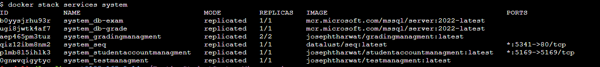

#How to run 
git clone https://github.com/joseph-tharwat/TestingStudentSystem_Microservice-.git
cd TestingStudentSystem_Microservice-/

docker swarm init 
if can not run add your ip like this: docker swarm init  --advertise-addr "192.168.0.19"

docker stack deploy -c docker-stack.yml system

